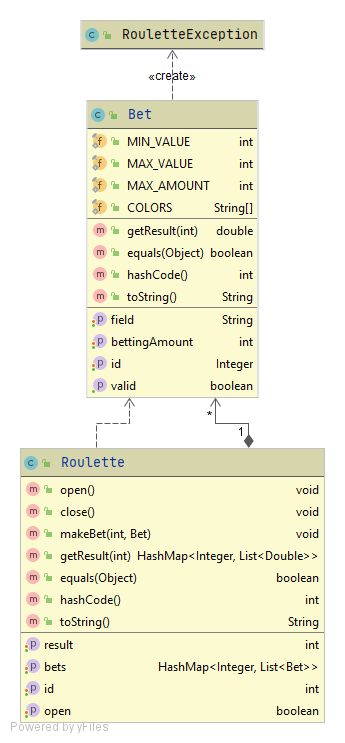

# Masiv technical test

## API of an online betting roulette


## Starting 🚀
This repository is a technical test made for the company 'Masiv'. It is a clean code test.
Spring Boot framework was used for the implementation of the API.

The application has the following class diagram:


### Pre-requisites 📋

* Java 8
* Maven (Apache Maven)
* Git
* Docker
* Postman

You have to download a Redis container from Docker to get a connection to the Database.

For that, create a docker container of Redis:

```
docker run -d --name redis -p 6379:6379 redis
```

In case that you don´t want to, there is another implementation called "inMemoryPersistence" which has the same funcionality but using the server as a persistence tool.
So, if you want to change it, you just have to change the DI at the services layer. For that, go to the file "RouletteServiceImpl.java" and change to this:

```
    @Autowired
    @Qualifier("inMemoryPersistence")
    RoulettePersistence roulettePersistence;
```


### Installation and execution 🔧

1. Clone the repository

```
git clone https://github.com/sebastianfrasic/PruebaTecnica-Masiv
```

2. On a terminal:

```
mvn package
```


3. To run the application:

```
java -cp target/classes;target/dependency/* masiv.MasivApplication
```
In order to visualize and test the API it is recommended to use the Postman tool.
However, it can also be viewed from a web browser by entering the following URL:

```
localhost:8080/app/roulettes
```

4. To see the dockerized application:

https://hub.docker.com/repository/docker/sebastianfrasic/roulette-api

To pull it:
```
docker pull sebastianfrasic/roulette-api:latest
```


## Built with 🛠️

* Java 8
* Spring Boot Framework
* Apache Maven
* Redis
* Docker
* IntelliJ IDEA


## Author ✒️

* Juan Sebastián Frásica Galeano

## License 📄

This project is licensed under the GNU General Public License - [LICENSE](LICENSE) 


